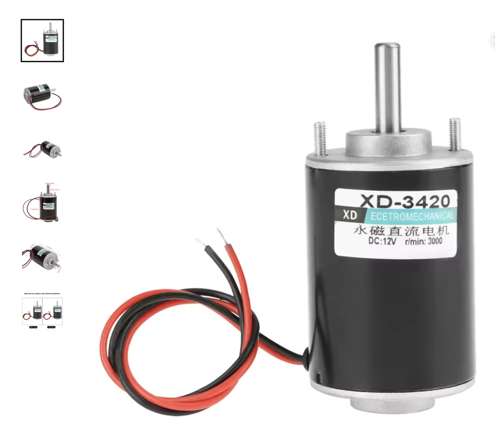
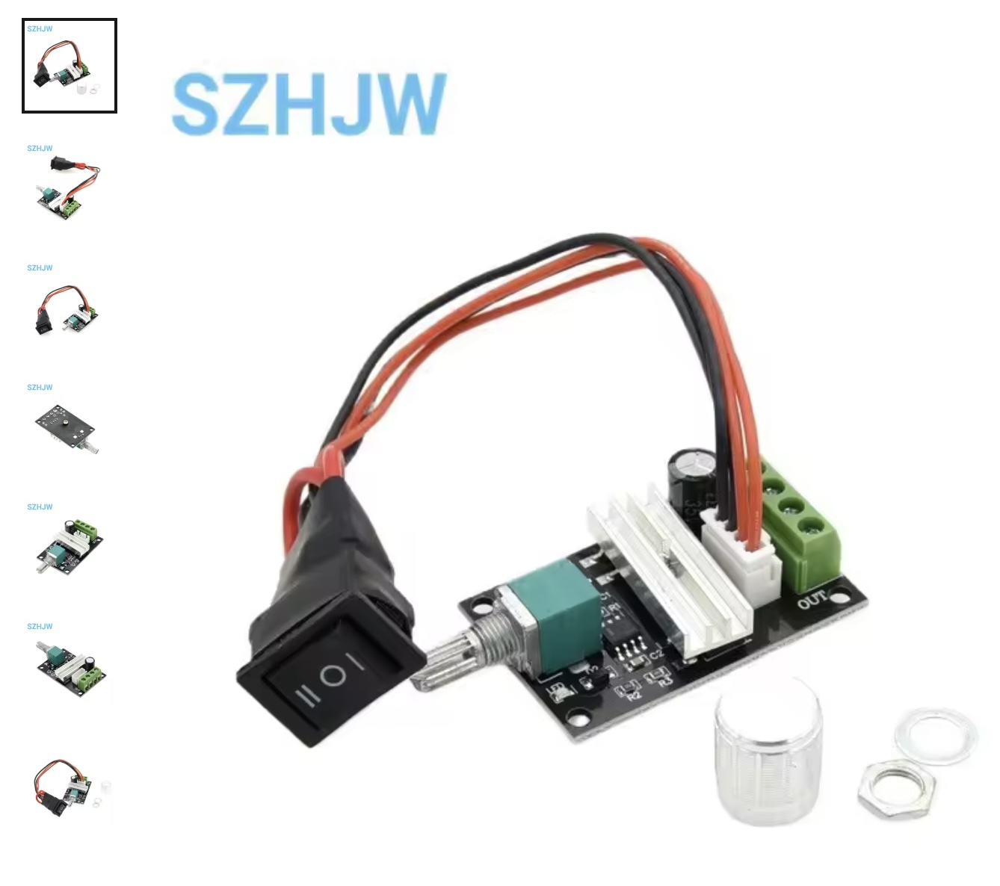

# Bloom Strobe – Demo Mode v4.4

Dieses Projekt basiert auf dem Grundprojekt von [lesfrerespoulain.fr](https://lesfrerespoulain.fr/zootrope/) und wurde von mir angepasst, um Demo-Modi, manuellen Potentiometer-Modus und LED-Strobe-Frequenzen für die Bloom-Skulptur zu implementieren.

Es handelt sich um eine Arduino-Steuerung für einen LED-Streifen mit MOSFET, um den Bloom-Effekt einer geometrischen Skulptur sichtbar zu machen.

---

## Inhaltsverzeichnis

1. [Beschreibung](#beschreibung)
2. [Hardware](#hardware)
3. [Pin-Belegung](#pin-belegung)
4. [Manueller Modus](#manueller-modus)
5. [Demo-Modus](#demo-modus)
6. [Frequenzen & Ablauf](#frequenzen--ablauf)
7. [Ablaufdiagramm](#ablaufdiagramm)
8. [Installation](#installation)
9. [Bilder](#bilder)
10. [STL-Dateien](#stl-dateien)
11. [Lizenz](#lizenz)

---

## Beschreibung

Dieses Projekt steuert einen LED-Streifen über einen MOSFET (z. B. IRLZ34N), um den Bloom-Effekt einer geometrischen Skulptur sichtbar zu machen.

Funktionen:

- **Manueller Modus**: Steuerung der Strobe-Frequenz über ein Potentiometer.
- **Demo-Modus**: Automatische Zyklen mit festen Frequenzen und Pausen.
- **Automatischer Start**: Demo beginnt nach 10 s Inaktivität am Potentiometer.

---

## Hardware

- Arduino Uno / Nano / kompatibel
- LED-Streifen (5–12 V, über MOSFET angesteuert)
- IRLZ34N MOSFET
- Potentiometer (10 kΩ empfohlen)
- **Motor**: XD-3420 12/24V 30W Permanentmagnet-Gleichstrommotor (Hochgeschwindigkeit CW/CCW) [Link](https://de.aliexpress.com/item/1005009822574204.html)
- **Motorcontroller**: 6V–28V DC Motor Drehzahlregler PWM, einstellbarer Umkehrschalter, 3A, 80W (1203BB) [Link](https://de.aliexpress.com/item/1005007047488195.html)
- Hinweis: Motor und Controller laufen unabhängig vom Arduino, werden nur separat über das Netzteil gesteuert.
- Verbindungskabel, Netzteil passend zum LED-Streifen

---

## Pin-Belegung

| Bauteil           | Arduino Pin |
|------------------|------------|
| MOSFET Gate       | D9         |
| Potentiometer     | A0         |
| GND               | GND        |
| LED-Streifen +    | externes Netzteil |
| LED-Streifen -    | MOSFET Drain → GND |

> Hinweis: Motor und Controller sind nicht über den Arduino angesteuert.

---

## Manueller Modus

- Frequenzbereich: **20–80 Hz**
- Links = LED aus, rechts = maximale Frequenz
- Potentiometer-Bewegung **unterbricht Demo sofort**
- Frequenz wird in **0,5 Hz Schritten** gerundet

---

## Demo-Modus

- Startet automatisch nach **10 s ohne Poti-Bewegung**
- Zwei feste Demo-Zyklen: 

1. **Demo1** – 36 Hz, 10 s
2. **Demo2** – 72 Hz, 10 s

- **3 vollständige Wiederholungen** → danach **Pause 10 s**
- Zyklus wiederholt sich

---

## Frequenzen & Ablauf

| Phase      | Frequenz | Dauer  | Wiederholung |
|------------|----------|--------|--------------|
| Demo1      | 36 Hz    | 10 s   | 3×           |
| Demo2      | 72 Hz    | 10 s   | 3×           |
| Pause      | LED aus  | 10 s   | 1×           |
| → wieder Demo1 ... | … | … | … |

---

## Ablaufdiagramm

```text
+----------------+     10s     +----------------+     10s     +----------------+
|    Demo1 36Hz  | ---------> |    Demo2 72Hz  | ---------> | Demo1 36Hz ... |
+----------------+            +----------------+            +----------------+
         |                                                       
         | 3 Wiederholungen                                        
         v                                                       
      +------------+                                             
      |  Pause 10s |                                             
      +------------+                                             
         |                                                       
         +----------------> Zyklus wiederholt sich               
```

---

## Installation

1. Arduino IDE öffnen
2. Sketch v4.4 hochladen
3. Pins wie oben verbinden
4. LED-Streifen mit MOSFET über externes Netzteil versorgen
5. Motor und Controller unabhängig über passendes Netzteil anschließen
6. Poti für manuelle Steuerung anschließen

---

## Beispiel Serial-Monitor Ausgabe

```
Hz: 36.0
Hz: 36.0
...
Hz: 72.0
Hz: 72.0
...
PAUSE LED OFF
```

---

## Bilder






---

## STL-Dateien

Die STL-Dateien für die 3D-Druckkomponenten der Bloom-Skulptur können hier heruntergeladen werden: 

- [Axe_Moteur.stl](stl/Axe_Moteur.stl)
- [Bague_Moteur.stl](stl/Bague_Moteur.stl)
- [Base.stl](stl/Base.stl)
- [Top.stl](stl/Top.stl)
- [Twist_Zoetrope_Double_Ring-Adapte.stl](stl/Twist_Zoetrope_Double_Ring-Adapte.stl)
- [Zoetrope_cube_Adapte.stl](stl/Zoetrope_cube_Adapte.stl)

> Lege dazu einen Ordner `stl` im Repository an und lade die Dateien hinein.

---

## Lizenz

MIT License – frei zur Nutzung und Anpassung
